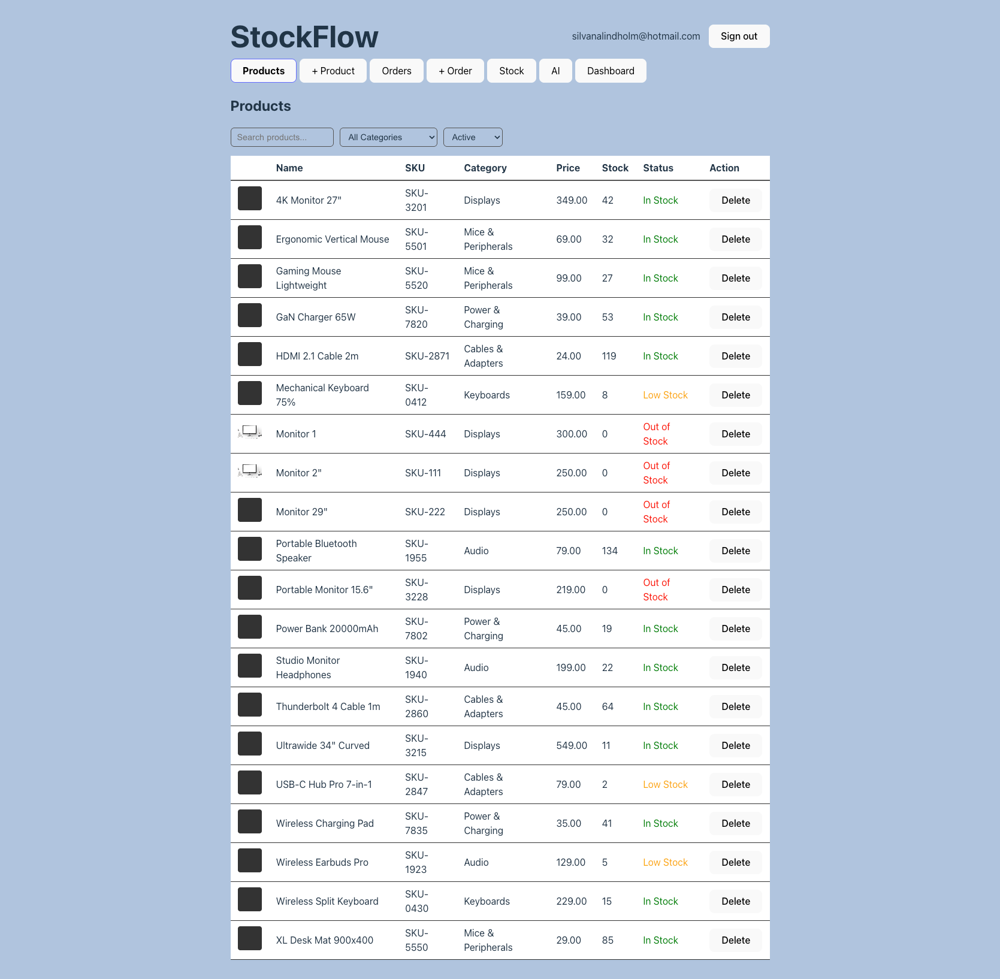
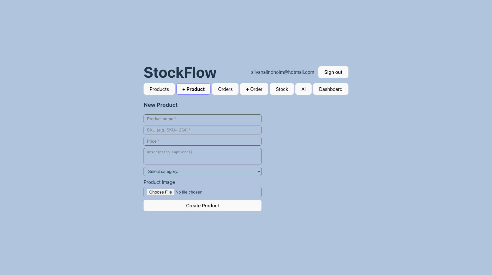
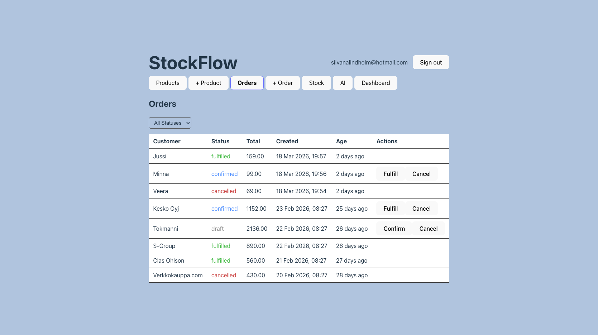
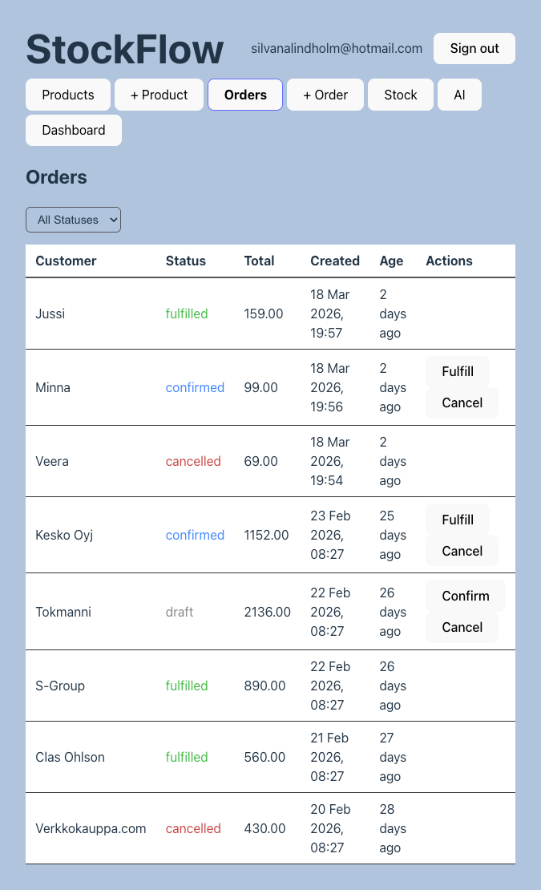
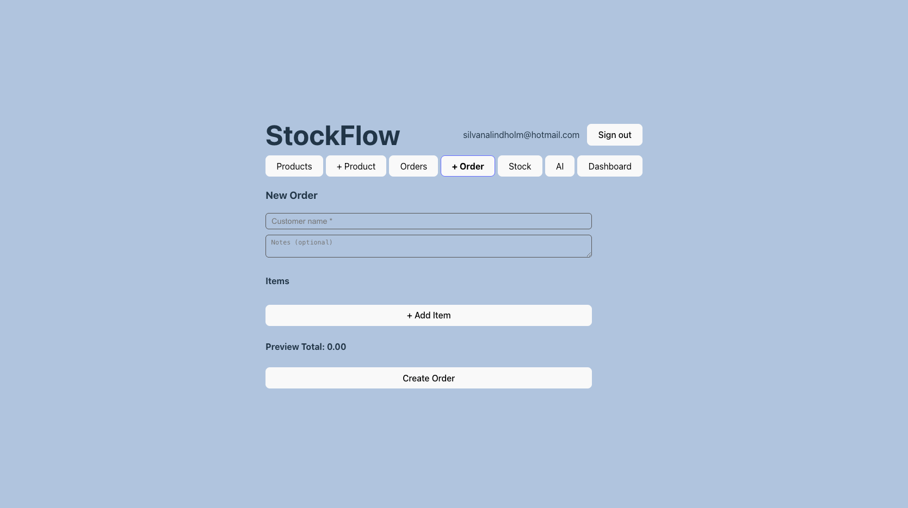
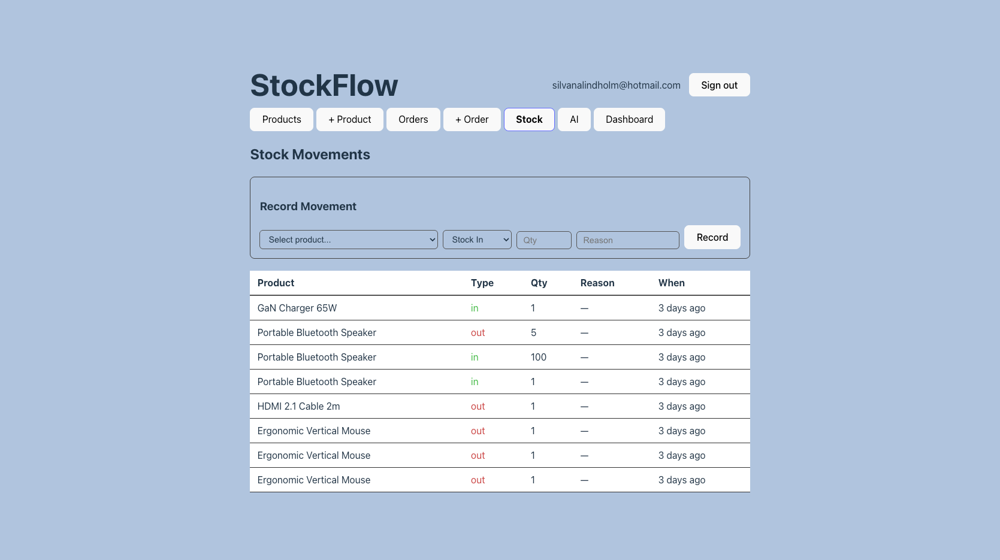
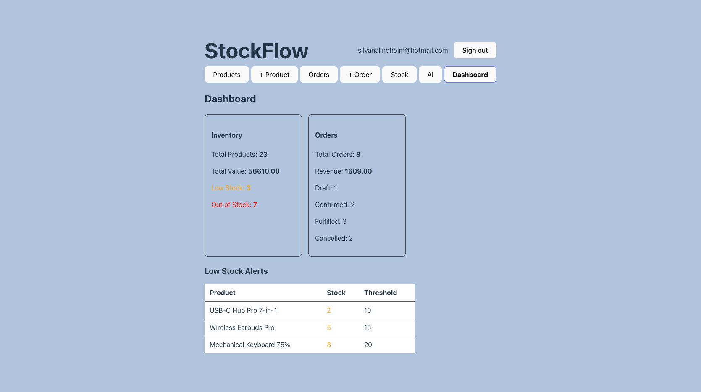

# StockFlow

A full-stack training project for inventory management, products, orders, stock movements, and AI-assisted insights.

The project is split into:

- PHP REST API (Slim 4) in the api folder
- React client (Vite) in the client/@ folder
- Supabase for database, Auth, and Storage
- Gemini (Google AI) for AI features

---

## 1. What This Project Is

StockFlow is a system for:

- viewing and filtering products
- creating and editing products
- uploading product images
- creating and managing orders
- changing order statuses (draft, confirmed, fulfilled, cancelled)
- recording inbound/outbound stock movements
- dashboard analytics
- AI features:
  - product description generation
  - low-stock recommendations
  - order summaries

---

## 2. Technologies

- Backend: PHP 8.1+ / Slim 4
- Frontend: React 19 + Vite
- Data/Auth/Storage: Supabase (PostgreSQL + RLS + OAuth + Storage)
- AI: Gemini 2.0 Flash (Google)
- Frontend HTTP client: fetch API

---

## 3. Quick Start (Local)

### 3.1 Prerequisites

- PHP 8.1+
- Composer
- Node.js 18+ and npm
- Supabase project
- Google Cloud project (for Google OAuth)
- Google AI Studio API key (for Gemini)

### 3.2 Start Backend

Open terminal 1:

```bash
cd stockflow/api
composer install
php -S localhost:8005 -t public/
```

Backend URL:

- http://localhost:8005
- API base path: http://localhost:8005/api

### 3.3 Start Frontend

Open terminal 2:

```bash
cd stockflow/client/@
npm install
npm run dev
```

Frontend URL (Vite):

- usually http://localhost:5173
- if the port is busy: http://localhost:5174

### 3.4 Useful Commands

Frontend:

```bash
cd stockflow/client/@
npm run dev
npm run build
npm run preview
npm run lint
```

Backend:

```bash
cd stockflow/api
composer install
php -S localhost:8005 -t public/
```

Alternative (from client/@):

```bash
cd stockflow/client/@
npm run server
```

---

## 4. ENV Configuration

api/.env should contain:

```env
SUPABASE_URL=
SUPABASE_ANON_KEY=
SITE_URL=http://localhost:8005
CLIENT_URL=http://localhost:5173
GEMINI_API_KEY=
# AI_FALLBACK_ENABLED=false
```

Important:

- do not commit real keys to GitHub
- if your frontend starts on 5174, set CLIENT_URL to http://localhost:5174

---

## 5. Complete Build and Connection Sequence

This is the recommended step-by-step order.

### Step 1: Clone and local setup

```bash
git clone https://github.com/1967cooder/stockflow.git
cd stockflow
```

### Step 2: Create a Supabase project

Where:

- https://supabase.com/dashboard

What:

- New project
- wait for initialization to finish

### Step 3: Get Supabase URL and anon key

Where in Supabase:

- Project Settings -> API

What to copy:

- Project URL -> SUPABASE_URL
- anon public key -> SUPABASE_ANON_KEY

### Step 4: Configure Google OAuth in Google Cloud Console

Where:

- https://console.cloud.google.com

What to do:

1. Create/select a Google Cloud project.
2. Open APIs & Services.
3. Configure OAuth consent screen.
4. Create OAuth Client ID (Web application).
5. Add Authorized redirect URI:
   - https://YOUR_SUPABASE_PROJECT_REF.supabase.co/auth/v1/callback
6. Save Client ID and Client Secret.

### Step 5: Connect Google OAuth in Supabase

Where in Supabase:

- Authentication -> Providers -> Google

What to do:

1. Enable Google provider.
2. Paste Client ID and Client Secret from Google Cloud.
3. Save.

### Step 6: Configure URL settings in Supabase Auth

Where in Supabase:

- Authentication -> URL Configuration

What to set:

- Site URL: http://localhost:5173
- Redirect URLs:
  - http://localhost:5173/auth/callback
  - http://localhost:5174/auth/callback

### Step 7: Prepare tables in Supabase

Where:

- Supabase -> SQL Editor

Minimum tables used by the API:

- categories
- products
- orders
- order_items
- stock_movements
- user_roles (for role-based policies)

Note:

- if you already have the SQL schema from the course, run it here.

### Step 8: Configure RLS policies (minimum)

Where:

- Supabase -> Authentication -> Policies

Critical for public product listing:

```sql
ALTER POLICY "Anyone can view products" ON products USING (true);
```

### Step 9: Create Supabase Storage bucket for images

Where:

- Supabase -> SQL Editor (or Storage UI)

SQL option:

```sql
INSERT INTO storage.buckets (id, name, public)
VALUES ('product-images', 'product-images', true);

CREATE POLICY "Public read access for product images"
ON storage.objects FOR SELECT
USING (bucket_id = 'product-images');

CREATE POLICY "Authenticated users can upload product images"
ON storage.objects FOR INSERT
WITH CHECK (bucket_id = 'product-images' AND auth.uid() IS NOT NULL);

CREATE POLICY "Authenticated users can delete product images"
ON storage.objects FOR DELETE
USING (bucket_id = 'product-images' AND auth.uid() IS NOT NULL);
```

### Step 10: Get Gemini API key from AI Studio

Where:

- https://aistudio.google.com

What to do:

1. Sign in.
2. Create API key.
3. Put the key in GEMINI_API_KEY in api/.env.

### Step 11: Run backend + frontend

```bash
# Terminal 1
cd stockflow/api
composer install
php -S localhost:8005 -t public/

# Terminal 2
cd stockflow/client/@
npm install
npm run dev
```

### Step 12: Smoke test

1. Open the frontend URL.
2. Check the Products tab.
3. Sign in with Google.
4. Check Orders, Stock, Dashboard, and AI.

---

## 6. Where External Services Are Connected

### Supabase

- api/src/Auth/SupabaseAuth.php
  - uses SUPABASE_URL and SUPABASE_ANON_KEY
  - sends REST requests to /rest/v1
  - uploads files to /storage/v1/object
  - generates Google OAuth URL via /auth/v1/authorize

### Google Cloud Console

- used for OAuth credentials (Client ID/Secret)
- these credentials are saved in Supabase Google provider settings
- the app does not call Google OAuth APIs directly; Supabase acts as the intermediary

### Google AI Studio

- used to create GEMINI_API_KEY
- api/src/AI/GeminiAI.php sends requests to:
  - https://generativelanguage.googleapis.com/v1beta/models/gemini-2.0-flash:generateContent

---

## 7. API Overview

Auth:

- GET /api/auth/login-url
- GET /api/auth/user

Products:

- GET /api/products
- GET /api/categories
- GET /api/products/{id}
- POST /api/products
- PUT /api/products/{id}
- DELETE /api/products/{id}
- POST /api/products/upload-image

Orders:

- GET /api/orders
- GET /api/orders/{id}
- POST /api/orders
- PUT /api/orders/{id}/status

Stock:

- GET /api/stock/movements
- POST /api/stock/movements

Dashboard:

- GET /api/dashboard/summary

AI:

- POST /api/ai/describe
- POST /api/ai/stock-advice
- POST /api/ai/summarize-orders

---

## 8. Screenshots from public

### Products



### New Product



### Orders



### Orders (Mobile)



### New Order



### Stock



### Dashboard



---

## 9. Project Structure

```text
stockflow/
├─ api/
│  ├─ .env
│  ├─ composer.json
│  ├─ Dockerfile
│  ├─ public/
│  │  ├─ .htaccess
│  │  ├─ index.php
│  │  └─ test.php
│  ├─ src/
│  │  ├─ AI/
│  │  │  └─ GeminiAI.php
│  │  ├─ Auth/
│  │  │  └─ SupabaseAuth.php
│  │  ├─ Middleware/
│  │  │  └─ AuthMiddleware.php
│  │  └─ Routes/
│  │     ├─ _route_examples.php
│  │     ├─ ai.php
│  │     ├─ auth.php
│  │     ├─ dashboard.php
│  │     ├─ notes.php
│  │     ├─ orders.php
│  │     ├─ products.php
│  │     └─ stock.php
│  └─ vendor/
└─ client/
   └─ @/
      ├─ package.json
      ├─ vite.config.js
      ├─ public/
      │  ├─ dashboard.png
      │  ├─ order.png
      │  ├─ orders.png
      │  ├─ orders_mobile.png
      │  ├─ product.png
      │  ├─ products.png
      │  └─ stock.png
      └─ src/
         ├─ App.jsx
         ├─ components/
         ├─ services/
         └─ main.jsx
```

---

## 10. Docker (Optional for API)

You can also run the API with Docker:

```bash
cd stockflow/api
docker build -t stockflow-api .
docker run --rm -p 8005:8005 --env-file .env stockflow-api
```

Then run the frontend normally with npm run dev.

---

## 11. Common Issues

1. Empty Products list without an error:
   - check RLS SELECT policy for products

2. CORS error:
   - CLIENT_URL in api/.env must match your Vite URL

3. 401/403 on protected endpoints:
   - sign in with Google
   - check that token is stored in localStorage
   - verify RLS policies and user_roles

4. Image upload does not work:
   - product-images bucket is missing
   - missing Storage INSERT policy

5. AI endpoint returns an error:
   - missing/invalid GEMINI_API_KEY
   - quota/rate limit in Google AI Studio

---

## 12. Contacts

- Main channel: GitHub Issues
- Issues URL: https://github.com/1967cooder/stockflow/issues

---

## 13. Author

- [1967cooder (repository owner)](https://github.com/1967cooder?tab=repositories)
- Project base: training course for PHP + React + Supabase
- [Portfolio] https://portfolio-react-silvana.netlify.app/

---

## 14. GitHub

- Repository: https://github.com/1967cooder/stockflow
